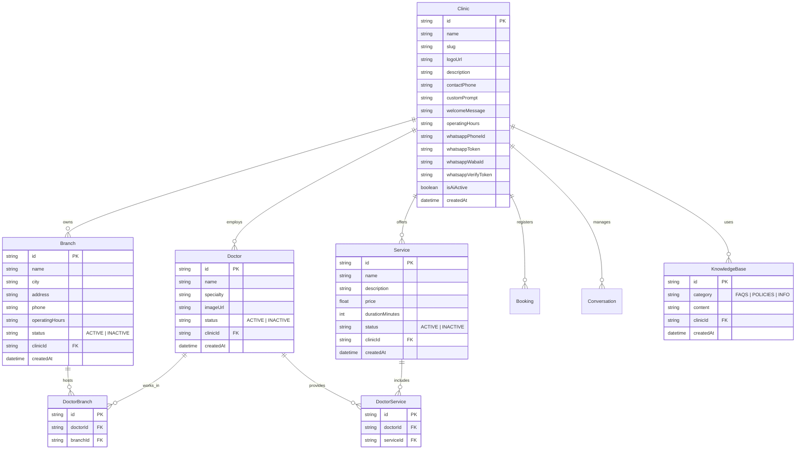

# System Design — Clinic Configuration Engine v1.0

تحدد هذه الوثيقة التصميم الهندسي المتكامل لتطوير موديول **إعدادات العيادة (Clinic Configuration Engine)** للمنصة، بهدف نقل النظام إلى مرحلة **المنتج التجاري (SaaS Enablement)**.

---

## 1. نموذج المجال (Domain Model)

تتألف العيادة من مجموعة من المكونات المترابطة التي تدير الكتالوج الطبي للعيادة الواحدة (Tenant):
* **Clinic Profile (الملف التعريفي للعيادة):** الهوية الأساسية (الاسم، الشعار، بيانات التواصل).
* **Branch (الفروع):** CRUD للفروع مع تحديد حالة الفرع وأوقات عمله.
* **Service (الخدمات):** CRUD للخدمات الطبية مع تحديد الأسعار والمدة وحالة التفعيل.
* **Doctor (الأطباء):** CRUD للأطباء مع تخصصاتهم، وربطهم بالفروع التي يعملون فيها والخدمات التي يقدمونها.
* **AI & WhatsApp Config:** تخصيص الموجه (Prompt) ورسالة الترحيب وبيانات ربط Meta Cloud API.
* **Knowledge Base (قاعدة المعرفة):** مستندات مخصصة للـ RAG (الأسئلة الشائعة وسياسات العيادة).

---

## 2. مخطط العلاقات (ERD Diagram)



---

## 3. تحديث نموذج قاعدة البيانات (Prisma Schema)

نقوم بتحديث [schema.prisma](file:///c:/Users/20101/saas-clinic-ai/prisma/schema.prisma) كالتالي لدعم العلاقات والموديلات الجديدة:

```prisma
model Clinic {
  id                  String         @id @default(cuid())
  name                String
  slug                String         @unique
  logoUrl             String?
  description         String?        @db.Text
  contactPhone        String?
  customPrompt        String?        @db.Text
  welcomeMessage      String?        @db.Text
  operatingHours      String?        @db.Text
  
  // WhatsApp Meta Cloud API Configuration
  whatsappPhoneId     String?
  whatsappToken       String?        @db.Text
  whatsappWabaId      String?
  whatsappVerifyToken String?
  isAiActive          Boolean        @default(true)

  createdAt           DateTime       @default(now())
  branches            Branch[]
  doctors             Doctor[]
  services            Service[]
  bookings            Booking[]
  conversations       Conversation[]
  knowledgeBase       KnowledgeBase[]
}

model Branch {
  id             String         @id @default(cuid())
  name           String
  city           String
  address        String
  phone          String?
  operatingHours String?        @db.Text
  status         String         @default("ACTIVE") // ACTIVE, INACTIVE
  clinicId       String
  clinic         Clinic         @relation(fields: [clinicId], references: [id], onDelete: Cascade)
  doctors        DoctorBranch[]
  createdAt      DateTime       @default(now())
}

model Doctor {
  id        String         @id @default(cuid())
  name      String
  specialty String
  imageUrl  String?
  status    String         @default("ACTIVE") // ACTIVE, INACTIVE
  clinicId  String
  clinic    Clinic         @relation(fields: [clinicId], references: [id], onDelete: Cascade)
  branches  DoctorBranch[]
  services  DoctorService[]
  createdAt DateTime       @default(now())
}

model Service {
  id              String          @id @default(cuid())
  name            String
  description     String?         @db.Text
  price           Float
  durationMinutes Int             @default(30)
  status          String          @default("ACTIVE") // ACTIVE, INACTIVE
  clinicId        String
  clinic          Clinic          @relation(fields: [clinicId], references: [id], onDelete: Cascade)
  doctors         DoctorService[]
  createdAt       DateTime        @default(now())
}

// Join model for Doctor-Branch relationship
model DoctorBranch {
  id       String @id @default(cuid())
  doctorId String
  doctor   Doctor @relation(fields: [doctorId], references: [id], onDelete: Cascade)
  branchId String
  branch   Branch @relation(fields: [branchId], references: [id], onDelete: Cascade)

  @@unique([doctorId, branchId])
}

// Join model for Doctor-Service relationship
model DoctorService {
  id        String  @id @default(cuid())
  doctorId  String
  doctor    Doctor  @relation(fields: [doctorId], references: [id], onDelete: Cascade)
  serviceId String
  service   Service @relation(fields: [serviceId], references: [id], onDelete: Cascade)

  @@unique([doctorId, serviceId])
}

model KnowledgeBase {
  id        String   @id @default(cuid())
  category  String   // FAQS, POLICIES, INFO
  content   String   @db.Text
  clinicId  String
  clinic    Clinic   @relation(fields: [clinicId], references: [id], onDelete: Cascade)
  createdAt DateTime @default(now())
}
```

---

## 4. عقود واجهات البرمجة (API Contracts)

جميع مسارات لوحة التحكم تشترط تمرير ترويسة المصادقة وصلاحيات الموظف/الأدمن، وسنستخدم الـ `clinicSlug` لتأمين سياق الطلب.

### أ. إعدادات العيادة العامة (`/api/clinic/config`)
* **`GET`**: لجلب تفاصيل ملف العيادة وإعداداتها.
  - **Query Parameters:** `clinicSlug: string`
  - **Output (200 OK):**
    ```json
    {
      "id": "cli_123",
      "name": "عيادة ريفال للتجميل",
      "logoUrl": "https://...",
      "welcomeMessage": "مرحباً بكِ في ريفال للتجميل 🌸",
      "operatingHours": "من السبت للخميس 10ص - 10م",
      "isAiActive": true
    }
    ```
* **`POST`**: لتحديث الملف العام للعيادة.
  - **Request Body DTO:** `UpdateClinicConfigDto`

### ب. إدارة الفروع (`/api/clinic/branches`)
* **`GET`**: جلب الفروع.
* **`POST`**: إضافة أو تحديث فرع (يحتوي على `id` للتعديل).
  - **Request Body DTO:** `UpsertBranchDto`
* **`DELETE`**: حذف فرع.
  - **Query Parameters:** `branchId: string`

### ج. إدارة الخدمات والأطباء (`/api/clinic/services` / `/api/clinic/doctors`)
* **`GET` / `POST` / `DELETE`**: لإجراء عمليات الـ CRUD والربط للخدمات والأطباء.

---

## 5. كائنات نقل البيانات وشروط التحقق (DTOs & Validation)

### 1. `UpdateClinicConfigDto`
```typescript
interface UpdateClinicConfigDto {
  clinicSlug: string; // Required for tenant match
  name: string; // Min length 3
  logoUrl?: string; // Optional URL format
  description?: string;
  contactPhone?: string; // Phone validation
  operatingHours?: string;
  welcomeMessage?: string;
  customPrompt?: string;
}
```

### 2. `UpsertBranchDto`
```typescript
interface UpsertBranchDto {
  id?: string; // Optional for creation, required for update
  clinicSlug: string;
  name: string; // Min length 3
  city: string; // Min length 2
  address: string; // Min length 5
  phone?: string;
  operatingHours?: string;
  status: "ACTIVE" | "INACTIVE";
}
```

### 3. `UpsertServiceDto`
```typescript
interface UpsertServiceDto {
  id?: string;
  clinicSlug: string;
  name: string; // Required
  description?: string;
  price: number; // Must be positive float (> 0)
  durationMinutes: number; // Must be positive integer (>= 10)
  status: "ACTIVE" | "INACTIVE";
}
```

### 4. `UpsertDoctorDto`
```typescript
interface UpsertDoctorDto {
  id?: string;
  clinicSlug: string;
  name: string; // Required
  specialty: string; // Required
  imageUrl?: string;
  status: "ACTIVE" | "INACTIVE";
  branchIds: string[]; // Arrays of branch IDs to link (DoctorBranch)
  serviceIds: string[]; // Arrays of service IDs to link (DoctorService)
}
```

---

## 6. رحلة تدفق الواجهة الأمامية (UI Flow Layout)

تتكامل صفحة الإعدادات الجديدة في لوحة التحكم الحالية عبر قائمة التبويبات المتجاوبة:

1. **التبويب الأول (ملف العيادة):** نموذج تحديث الاسم، الشعار، أوقات العمل العامة، ورسالة الترحيب.
2. **التبويب الثاني (الفروع):** جدول الفروع الحالية مع زر "إضافة فرع جديد" يفتح نموذجاً منبثقاً (Modal) لإدخال تفاصيل الفرع وحفظه.
3. **التبويب الثالث (الخدمات):** جدول الخدمات والأسعار وتعديلها.
4. **التبويب الرابع (الأطباء والربط):** جدول لإدارة الأطباء ونموذج منبثق يتيح اختيار الفروع المحددة والخدمات التي يقدمها هذا الطبيب بواسطة مربعات الاختيار (Checkboxes).
5. **التبويب الخامس (الواتساب والـ AI):** لوحة مدخلات Meta API ومفتاح تشغيل المساعد الذكي.

---

## 7. خطة الهجرة والترحيل (Migration Plan)

لتجنب أي فقدان للبيانات التجريبية الحالية في قاعدة البيانات، سنتبع مسار ترحيل آمن:
1. **ترحيل المخطط (Schema Migration):** تشغيل `npx prisma migrate dev --name init_clinic_configuration` لترقية الجداول وإضافة حقول العلاقات.
2. **تغذية البيانات القديمة (Data Seeding & Migration):** تعديل ملف `prisma/seed.ts` لتوليد الفروع والأطباء وربطهم الافتراضي ببعضهم للعيادة الأولى (`rival-clinic`).
3. **تحديث الكود القائم:**
   - تعديل دالة الاستقبال لقراءة الكتالوج الطبي حياً من جداول `Service` و `Doctor` و `Branch` المرتبطة بالعيادة بدلاً من الكتالوج الثابت.
