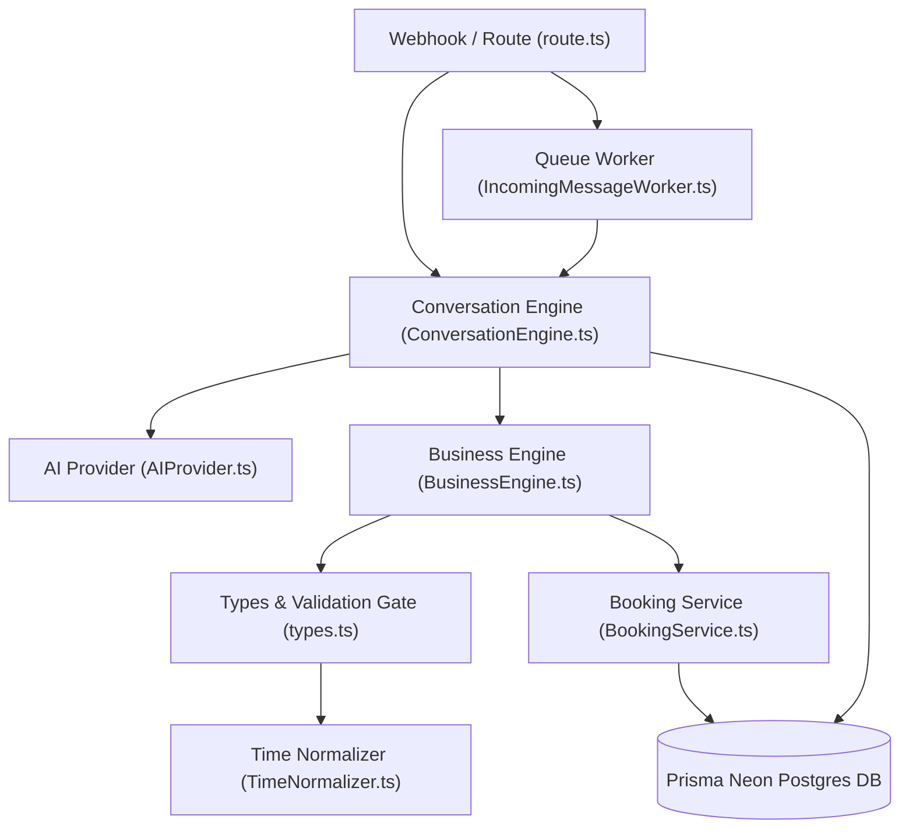

# 📑 Booking Pipeline Review Manifest & Independent Architecture Package (BOOKING_PIPELINE_REVIEW_MANIFEST.md)

## 📌 Executive Summary
تُمثل هذه الحزمة المعمارية **Code Review Package المستقلة لـ Booking Runtime Pipeline** في منصة Clinova. تم إعداد هذه الوثيقة لمراجعة المسار الحرج (Critical Path) من لحظة استقبال الرسالة إلى نقطة إنشاء الحجز، بدقة وبدون أي كتابة أو تعديل لسطر كود واحد.

---

## 🗺️ 1. Runtime Call Graph (من الرسالة إلى createBooking)

```text
[WhatsApp Meta Webhook] (src/app/api/webhook/whatsapp/route.ts)
   │
   ├── (If USE_QUEUE=true) ➔ [BullMQ Queue] ➔ [IncomingMessageWorker.ts]
   │                                                   │
   └───────────────────────┬───────────────────────────┘
                           ▼
             [ConversationEngine.processMessage()] (src/lib/domain/ConversationEngine.ts)
                           │
                           ├── 1. Read Conversation History ➔ [Prisma DB]
                           ├── 2. Classify & Extract ➔ [AIProvider.ts]
                           │                               │
                           │                               └─ Read System Prompt ➔ [system_prompt.txt]
                           │
                           ▼
             [BusinessEngine.processIntent()] (src/lib/domain/BusinessEngine.ts)
                           │
                           ├── 1. Entity Sanitization & Regex Fallbacks
                           ├── 2. Phone Auto-Injection ➔ [types.ts]
                           ├── 3. Validate Booking Data ➔ [validateBookingData() in types.ts]
                           │                                   │
                           │                                   └─ Time Normalization ➔ [TimeNormalizer.ts]
                           │
                           ├── 4. Fetch Available Slots ➔ [BookingService.getAvailableSlots()]
                           │                                   │
                           │                                   └─ Database Calendar Check ➔ [Prisma DB]
                           │
                           ├── 5. Double Booking Guard & Slot Matching Gate
                           │
                           ▼ (If all 6 gates pass)
             [BookingService.createBooking()] (src/lib/domain/BookingService.ts)
                           │
                           ▼
             [Prisma DB & Receptionist Dashboard]
```

---

## 📊 2. Dependency Graph (مخطط الاعتمادية المعماري)



---

## 📁 3. Detailed File Catalog for Independent Review

### Priority 1: Critical (ملفات البوابات الحرجة التي تمنع الحجز)

#### 1. `src/lib/domain/BusinessEngine.ts`
- **Full Path:** `file:///D:/saas-clinic-ai/src/lib/domain/BusinessEngine.ts`
- **Type:** `Core`
- **Caller:** `ConversationEngine.ts`
- **Callees:** `types.ts`, `TimeNormalizer.ts`, `BookingService.ts`
- **DB Operations:** Read (via `BookingService`), Write (indirectly via `createBooking`)
- **State Modifications:** Modifies `bookingData`, evaluates Validation Gates, handles Intent Escalation.
- **Impact:** **Critical** (Manages Double Booking Guard, slot availability matching, entity sanitization, and intent escalation).

#### 2. `src/lib/domain/types.ts`
- **Full Path:** `file:///D:/saas-clinic-ai/src/lib/domain/types.ts`
- **Type:** `Core`
- **Caller:** `BusinessEngine.ts`, `ConversationEngine.ts`
- **Callees:** `TimeNormalizer.ts`
- **DB Operations:** None (Pure Validation Functions)
- **State Modifications:** Sanitizes `ExtractedBookingData`, evaluates `phoneRestricted`, outputs `BookingValidationResult`.
- **Impact:** **Critical** (Contains `validateBookingData()` which enforces required field gates and country restrictions).

#### 3. `src/lib/domain/TimeNormalizer.ts`
- **Full Path:** `file:///D:/saas-clinic-ai/src/lib/domain/TimeNormalizer.ts`
- **Type:** `Core`
- **Caller:** `types.ts`, `BusinessEngine.ts`
- **Callees:** None (Pure Parsing Engine)
- **DB Operations:** None
- **State Modifications:** Normalizes raw time strings into canonical representations.
- **Impact:** **Critical** (Handles Date-Part Isolation, hour normalization, 12 PM defaults, and relative day mapping).

#### 4. `src/lib/domain/BookingService.ts`
- **Full Path:** `file:///D:/saas-clinic-ai/src/lib/domain/BookingService.ts`
- **Type:** `Core`
- **Caller:** `BusinessEngine.ts`, `api/bookings/route.ts`
- **Callees:** `PrismaClient` (`prisma.booking`)
- **DB Operations:** **Read & Write** (Inserts `Booking` records, checks slot collisions).
- **State Modifications:** Creates persistent `Booking` state in Neon Database.
- **Impact:** **Critical** (Generates `availableSlots` and executes final `createBooking()`).

---

### Priority 2: Business Logic & Orchestration (ملفات إدارة المحادثة والذكاء الاصطناعي)

#### 5. `src/lib/domain/ConversationEngine.ts`
- **Full Path:** `file:///D:/saas-clinic-ai/src/lib/domain/ConversationEngine.ts`
- **Type:** `Core`
- **Caller:** `route.ts`, `IncomingMessageWorker.ts`, `api/chat/route.ts`
- **Callees:** `AIProvider.ts`, `BusinessEngine.ts`, `PrismaClient`
- **DB Operations:** **Read & Write** (Reads/updates `prisma.conversation.messages`).
- **State Modifications:** Manages `currentState`, history merging, and conversation lifecycle.
- **Impact:** **High** (Central orchestrator of memory, intent processing, and response rendering).

#### 6. `src/lib/infrastructure/ai/AIProvider.ts`
- **Full Path:** `file:///D:/saas-clinic-ai/src/lib/infrastructure/ai/AIProvider.ts`
- **Type:** `Core`
- **Caller:** `ConversationEngine.ts`
- **Callees:** Gemini API / OpenAI API, `fs` (reads `system_prompt.txt`)
- **DB Operations:** None
- **State Modifications:** Extracts raw LLM `bookingData` JSON and classifies user intent.
- **Impact:** **High** (Determines raw extracted entities before business sanitization).

#### 7. `src/app/api/chat/system_prompt.txt`
- **Full Path:** `file:///D:/saas-clinic-ai/src/app/api/chat/system_prompt.txt`
- **Type:** `Supporting` (Prompt Configuration)
- **Caller:** `AIProvider.ts`
- **Callees:** None
- **DB Operations:** None
- **State Modifications:** Shapes LLM entity extraction behavior.
- **Impact:** **High** (Controls zero-hallucination rules and prompt responses).

---

### Priority 3: Infrastructure & Entry Points (ملفات الربط والشبكة وصفوف الانتظار)

#### 8. `src/app/api/webhook/whatsapp/route.ts`
- **Full Path:** `file:///D:/saas-clinic-ai/src/app/api/webhook/whatsapp/route.ts`
- **Type:** `Infrastructure` (Entry Point 1)
- **Caller:** Meta WhatsApp Webhook Engine
- **Callees:** `BullMQJobDispatcher.ts`, `ConversationEngine.ts`, Meta Graph API
- **DB Operations:** **Read & Write** (Idempotency via `prisma.processedWebhook`).
- **State Modifications:** Handles incoming HTTP POST payloads and dispatches messages.
- **Impact:** **Medium** (Network entry point and webhook verification).

#### 9. `src/lib/infrastructure/queue/IncomingMessageWorker.ts`
- **Full Path:** `file:///D:/saas-clinic-ai/src/lib/infrastructure/queue/IncomingMessageWorker.ts`
- **Type:** `Infrastructure` (Entry Point 2)
- **Caller:** BullMQ Redis Worker Loop
- **Callees:** `ConversationEngine.ts`, Meta Graph API
- **DB Operations:** Read (Clinic catalog fetch).
- **State Modifications:** Asynchronous message execution.
- **Impact:** **Medium** (Processes messages when queue mode `USE_QUEUE=true` is enabled).

#### 10. `src/app/api/chat/route.ts`
- **Full Path:** `file:///D:/saas-clinic-ai/src/app/api/chat/route.ts`
- **Type:** `Infrastructure` (Entry Point 3)
- **Caller:** Receptionist Dashboard Chat UI
- **Callees:** `ConversationEngine.ts`
- **DB Operations:** Read (Clinic catalog fetch).
- **State Modifications:** Triggers chat playground turns.
- **Impact:** **Medium** (Dashboard UI execution route).

#### 11. `src/app/api/bookings/route.ts`
- **Full Path:** `file:///D:/saas-clinic-ai/src/app/api/bookings/route.ts`
- **Type:** `Infrastructure` (Entry Point 4)
- **Caller:** Receptionist Dashboard Manual Booking Form
- **Callees:** `BookingService.ts`
- **DB Operations:** Read & Write via `BookingService`.
- **State Modifications:** Direct receptionist booking creation.
- **Impact:** **Low** (Bypasses AI dialogue pipeline for manual bookings).

---

## 🚪 4. Canonical Entry Points

| Entry Point Name | Source Path | Primary Consumer | Execution Mode |
|---|---|---|---|
| **WhatsApp Webhook** | `src/app/api/webhook/whatsapp/route.ts` | Meta WhatsApp Infrastructure | Sync OR Async (BullMQ) |
| **Queue Worker** | `src/lib/infrastructure/queue/IncomingMessageWorker.ts` | Upstash Redis Worker Loop | Async Queue Processing |
| **Dashboard Chat** | `src/app/api/chat/route.ts` | Web Dashboard UI Playground | Synchronous HTTP POST |
| **Dashboard Manual Booking** | `src/app/api/bookings/route.ts` | Receptionist Booking Form | Direct API Call |

---

## 👑 5. Runtime State Owners & Sources of Truth

| State Domain | Primary State Owner (Source of Truth) | File Location | Secondary / Replicas |
|---|---|---|---|
| **Customer Memory / Identity** | `ConversationEngine` (E.164 Phone) | `src/lib/domain/ConversationEngine.ts` | `prisma.customer` table |
| **Conversation State** | `prisma.conversation.messages` | `src/lib/db.ts` (Neon Postgres) | In-memory `currentState` |
| **Booking State** | `prisma.booking` table | `src/lib/domain/BookingService.ts` | `modifiedBookingData` object |
| **Time Slot Context** | `BookingService.getAvailableSlots()` | `src/lib/domain/BookingService.ts` | `TimeNormalizer.ts` |
| **Validation State** | `validateBookingData()` | `src/lib/domain/types.ts` | `BusinessEngine.ts` gates |

---

## 📖 6. Recommended Reading Order for Independent Reviewer

لإجراء مراجعة معمارية شمولية ومستقلة، يوصى بالترتيب التالي:

1. **`src/lib/domain/types.ts`**: وفيه تعريف بوابات الفحص والدوال الأساسية للتحقق (`validateBookingData`).
2. **`src/lib/domain/TimeNormalizer.ts`**: وفيه منطق تفسير الوقت، وتجريد التواريخ النصية، والتحويل القياسي.
3. **`src/lib/domain/BusinessEngine.ts`**: وفيه قواعد الأعمال الحاكمة، حارس المطابقة المزدوجة (Double Booking Guard)، وتنقيتها.
4. **`src/lib/domain/BookingService.ts`**: وفيه الاستعلام عن السلوتات المتاحة وحفظ الحجز النهائي في قاعدة البيانات.
5. **`src/lib/domain/ConversationEngine.ts`**: وفيه المنسق العام للمحركات والذاكرة.
6. **`src/app/api/webhook/whatsapp/route.ts`**: وفيه نقطة دخول الـ Webhook الحية.

---

🚫 **الملفات المفصول حذفها من نطاق هذه المراجعة (Ignored Files):**
- `src/lib/encryption.ts` (تشفير الـ Token فقط).
- `src/app/api/analytics/*` (تحليلات الأداء واللوحات).
- `src/app/api/onboarding/*` (إعداد العيادات الجديدة).
- `src/lib/infrastructure/queue/DocumentProcessorQueue.ts` (معالجة الملفات النصية وقاعدة المعرفة).
