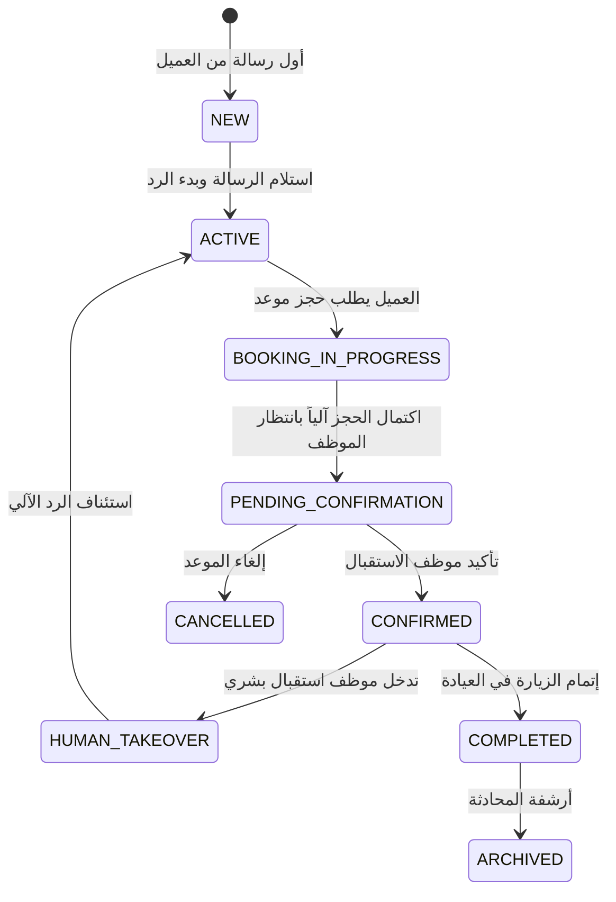

# 🏛️ Runtime State & Identity Architecture (Clinova Canonical Design)

## 📌 1. Executive Directive (الغاية المعمارية)
هذه الوثيقة هي **المرجع المعماري الرسمي والأعلى (Canonical Runtime Policy)** لإدارة الهوية، دورات الحياة، وسياسات الذاكرة والمزامنة عبر كافة طبقات منصة Clinova. تم تسوير هذا التصميم للقضاء النهائيات على الترقيع الموضعي (Local Patching)، ومنع تضارب حالات النظام بين محادثات واتساب، محرك الأعمال، لوحة موظفي الاستقبال، وقاعدة البيانات.

---

## 🆔 2. Customer Identity Policy (سياسة هوية العميل القياسية)

### 1.1 المعرّف الموحد للعميل (Canonical Customer Identifier)
- **الهوية المطلقة:** يُعامل **رقم الجوال بصيغة E.164 الدولية الموحدة (مثل `+966501234567` أو `+201152276498`)** كـ Single Source of Truth للتعريف بالعميل.
- **تأصيل الرقم:** عند استلام أي رسالة من Meta WhatsApp API، يُحفظ الرقم الدولي المقترن بالهاتف `clientPhone` بصيغة E.164 دائماً.
- **المنع المعماري:** يُمنع حظراً باتاً لأي مكون (سواء كان محرك الذكاء الاصطناعي أو نموذج الإدخال النصي) حفظ أو إنشاء سجل `Booking` برقم محلي مجرد (مثل `0501234567`) يختلف عن رقم المحادثة الدولي. أي رقم محلي يُدخل يتم تطبيعه فوراً (Normalized to E.164) قبل كتابته في قاعدة البيانات.

```typescript
// Canonical Identity Normalization Boundary
export function toCanonicalClientPhone(rawPhone: string, clinicCountryCode: string = "SA"): string {
  const normalized = extractSaudiPhone(rawPhone, clinicCountryCode);
  if (!normalized) {
    throw new Error(`Invalid non-canonical phone format: ${rawPhone}`);
  }
  return normalized; // Always returns E.164 string format e.g. "+966501234567"
}
```

---

## 🔄 3. Conversation Lifecycle (دورة حياة المحادثة)

تتحرك المحادثة عبر ثمانية حالات صريحة ومحددة الشروط (Explicit State Machine):



### شروط ومسؤوليات الانقال (Transition Ownership):

| الحالة السابقة | الحالة الجديدة | الشرط المحرك (Trigger) | المكون المسؤول (Owner) |
|---|---|---|---|
| `NEW` | `ACTIVE` | استلام أول webhook من واتساب | `ConversationEngine` |
| `ACTIVE` | `BOOKING_IN_PROGRESS` | اكتشاف قصد الحجز `BookAppointment` | `BusinessEngine` |
| `BOOKING_IN_PROGRESS` | `PENDING_CONFIRMATION` | استدعاء `createBooking()` واكتمال الحقل القياسي | `BookingService` |
| `PENDING_CONFIRMATION` | `CONFIRMED` | موافقة الاستقبال من اللوحة | `POST /api/bookings` |
| `CONFIRMED` | `HUMAN_TAKEOVER` | نقر الموظف على "إيقاف الذكاء الاصطناعي" | `POST /api/conversations/takeover` |
| `HUMAN_TAKEOVER` | `ACTIVE` | نقر الموظف على "تشغيل الرد الآلي" | `POST /api/conversations/takeover` |

---

## 🎟️ 4. Booking Lifecycle (دورة حياة الحجز)

تخضع الحجوزات لدورة حياة مستقلة تماماً ومحكومة بـ (ADR-006 State Transition Guard):

```text
DRAFT (في الذاكرة المؤقتة)
    ↓ (استدعاء createBooking عند اكتمال البيانات)
PENDING (في قاعدة البيانات - ينتظر مراجعة الاستقبال)
    ├──➔ CONFIRMED (تأكيد الموظف) ──➔ COMPLETED (تمت الزيارة)
    └──➔ CANCELLED (إلغاء من الموظف/العميل)
```

---

## 🧠 5. Customer Memory Policy (سياسة ذاكرة العميل والبيانات)

تحدد هذه المصفوفة الرسمية **ما يجوز إعادة استخدامه** وما **يجب طليبه مجدداً** لكل حقل بيانات عبر ثلاثة مستويات متمايزة:

### مصفوفة سياسة البيانات (Canonical Memory Matrix):

| حقل البيانات (Field) | الملف الدائم للعميل (Customer Profile) | حالة المحادثة الحالية (Current Conv State) | حجز جديد لخدمة أخرى (New Booking Request) | السياسة الرسمية (Canonical Policy) |
|---|---|---|---|---|
| **الاسم (Name)** | **يُعاد استخدامه (REUSE)** | يُعاد استخدامه | **يُعاد استخدامه (REUSE)** | الاسم يُحفظ كملف دائم للمريض. لا يُسأل العميل عن اسمه مجدداً في الحجوزات المستقبلية إلا إذا طلب تغييره. |
| **رقم الجوال (Phone)** | **يُعاد استخدامه (REUSE)** | يُعاد استخدامه | **يُعاد استخدامه (REUSE)** | يُسحب تلقائياً من رقم واتساب الدولي المعتمد E.164. |
| **الفرع (Branch)** | **يُعاد استخدامه كافترضي** | يُعاد استخدامه | **تأكيد أو اختيار (CONFIRM/ASK)** | يُستخدم الفرع المفضل كافتراضي إذا وُجد، ويطلب المحرك التأكيد إذا كان لدى العيادة أكثر من فرع نشط. |
| **الطبيب (Doctor)** | **لا يُعاد استخدامه (NO REUSE)** | يُعاد استخدامه أثناء الحجز الجاري | **يُطلب مجدداً (ASK AGAIN)** | لا يُسحب اسم الطبيب من حجز سابق لخدمة مختلفة. يُسأل المريض أو يُحل تلقائياً لـ "أي طبيب متاًح" أو طبيب الخدمة الوحيد. |
| **الخدمة (Service)** | **لا يُعاد استخدامه (NO REUSE)** | يُعاد استخدامه أثناء الحجز الجاري | **يُطلب مجدداً (ASK AGAIN)** | كل حجز جديد يتطلب تحديد الخدمة صراحةً. لا تُورث الخدمة من حجز سابق. |
| **الوقت (Time Slot)** | **لا يُعاد استخدامه (NO REUSE)** | يُعاد استخدامه أثناء الحجز الجاري | **يُطلب مجدداً (ASK AGAIN)** | ينتهي تاريخ الوقت فور إنشاء الحجز. يُمنع منعاً باتاً سحب موعد حجز سابق لحجز جديد. |

---

## 🏢 6. State Ownership (ملكية حالات النظام)

لضمان عدم وجود تضارب أو ازدواجية في الملكية (No Duplicated Ownership):

1. **العميل والهوية (Customer Identity):** الملكية لجدول `Clinic` + E.164 Phone Number.
2. **سجل الرسائل (Conversation History):** الملكية لـ `prisma.conversation`.
3. **بيانات مسودة الحجز الجاري (Draft Booking State):** الملكية لـ `BusinessEngine` في كائن الجلسة المؤقت، ولا تُحفظ في الرسائل السابقة المباشرة كمحدد دائم للمستقبل.
4. **سجل الحجز الفعلي (Booking Record):** الملكية الحصرية لـ `prisma.booking`.
5. **جدول الأطباء والمواعيد (Calendar & Availability):** الملكية الحصرية لـ `BookingService`.

---

## 🔗 7. Synchronization Rules (قواعد المزامنة بين الطبقات)

تخضع كافة التدفقات لقواعد المزامنة الصريحة التالية:

```text
[WhatsApp Meta Webhook]
       ↓ (التأكد من E.164 Phone Format)
[Conversation Engine]
       ↓ (قراءة الاسم فقط من Profile، ومسح مسودة الحجز السابق عند بدء حجز جديد)
[Business Engine]
       ↓ (مطابقة المواعيد عبر isoDate + timeStr)
[Database (Prisma)]
       ↓ (ربط المحادثة مع الحجز عبر E.164 Phone الموحد)
[Reception Dashboard]
       ↓ (تأكيد الحجز يحدّث Booking.status + Conversation.updatedAt + إرسال واتساب)
[Patient WhatsApp Notification]
```

### قواعد المزامنة الإلزامية:
1. **قاعدة 1 (الربط الموحد):** يتم استعلام الربط بين الحجز والمحادثة في Dashboard عبر **E.164 Phone الموحد دائماً**، مما يلغي تماماً مشكلة اختفاء المحادثات أو ظهور "عميل جديد".
2. **قاعدة 2 (التحديث التفاعلي للمحادثة):** عند تغيير حالة الحجز إلى `CONFIRMED` من اللوحة، يلتزم النظام بـ:
   - تحديث حالة `Booking.status` ➔ `CONFIRMED`.
   - تحديث تاريخ المحادثة `Conversation.updatedAt = new Date()`.
   - إرسال تنبيه تأكيد تلقائي للمريض على واتساب (Outbound Notification).
3. **قاعدة 3 (عزل مسودة الحجز):** عند اكتمال حجز وتأكيده، يتم إرسال `sessionReset: true` في سياق المحادثة لمنع تسرب بيانات الطبيب والفرع والوقت إلى الحجوزات المستقبلية.

---

## 🔒 8. الخلاصة والخطوة التالية (Architectural Sign-off)
بهذه الوثيقة المعمارية المعتمدة، تصبح كافة السلوكيات ومسارات التشغيل مبنية على **سياسة موحدة وشاملة (Canonical Policy)** بدلاً من الـ Patches الموضعية. وتُعد هذه الوثيقة المرجع الأساسي لتطبيق أي إصلاحات كود قادمة بثقة واستقرار كامل.
