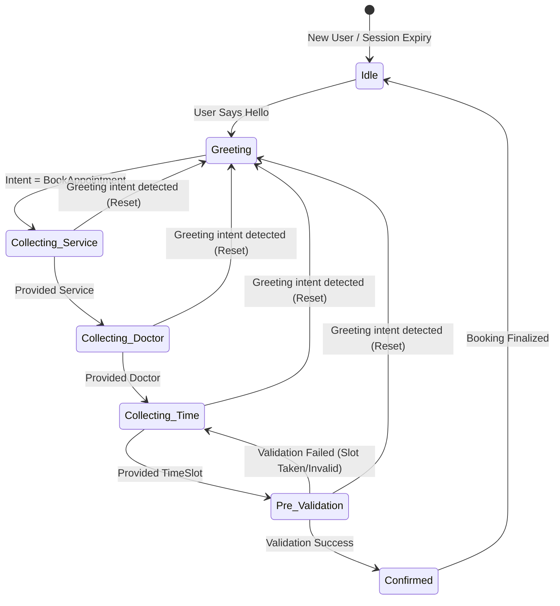

# Unified Architecture Design

## 1. Complete State Diagram (FSM)
The conversation system is governed by a Finite State Machine (FSM) that tracks the user's booking journey.


*Note: Any step can trigger a soft reset back to Greeting or Idle if the user expresses a clear non-booking intent or failure loops exceed limits.*

## 2. Unified Data Contract
All conversation sessions must maintain a standardized `bookingData` object in state.

### `BookingData` Schema
```typescript
interface BookingData {
  userId: string;
  source: "WhatsApp" | "Web" | "Instagram";
  
  // Core Booking Info
  serviceId: string | null;
  doctorId: string | null;
  branchId: string | null;
  
  // Canonical Time Representation
  timeSlot: string | null; // ISO-8601 DateTime (e.g., "2026-07-27T10:00:00Z")
  
  // Derived/Raw Text (for context)
  rawIntentText: string;
  
  // State specific
  validationAttempts: number;
}
```

**Database Serialization (Neon PostgreSQL):**
The state is serialized into a JSONB column `session_data` in the `conversations` table. All time values must be normalized to standard ISO-8601 UTC before persistence.

## 3. Dependency Matrix
How the FSM state changes interact with core modules.

| FSM State Transition | `TimeNormalizer.ts` Usage | Soft Gates Activated | Redis Fallback Circuit Breaker |
|----------------------|----------------------------|------------------------|--------------------------------|
| `Idle` -> `Greeting` | N/A                        | None                   | Passive monitoring             |
| `*` -> `Collecting_Time` | Extracts initial time entities | `Verify Time Exists` | Skips NLP if Redis is down     |
| `Collecting_Time` -> `Pre_Validation` | Normalizes text to Canonical ISO-8601 | `Availability Check`, `Double-Booking Guard` | Uses DB if Redis cache fails |
| Validation Fails | Clears `timeSlot`, logs failure | `Prompt Retry` | Tracks failure rate            |

## 4. Migration Plan
To handle legacy conversation data with old or corrupted `bookingData` shapes:

1. **Schema Addition:** Introduce a `schema_version` column to the `conversations` table (default 1). New standard will be version 2.
2. **Lazy Migration on Read:** When a session is loaded from the DB:
   - If `schema_version < 2`:
     - Run a migration utility function (`migrateLegacySession(session)`).
     - Attempt to parse legacy `timeSlot` strings using `TimeNormalizer.ts` into ISO-8601 format.
     - Reset `validationAttempts` and ensure all required Canonical fields exist.
     - Save back to DB asynchronously.
3. **Background Batch Migration:** A nightly background cron job will scan the database for active sessions with `schema_version < 2` and upgrade them to reduce read-time overhead.
4. **Data Discard Policy:** Any session older than 24 hours with a legacy schema that fails parsing will be reset to `Idle` state to prevent unexpected loops for returning users.
